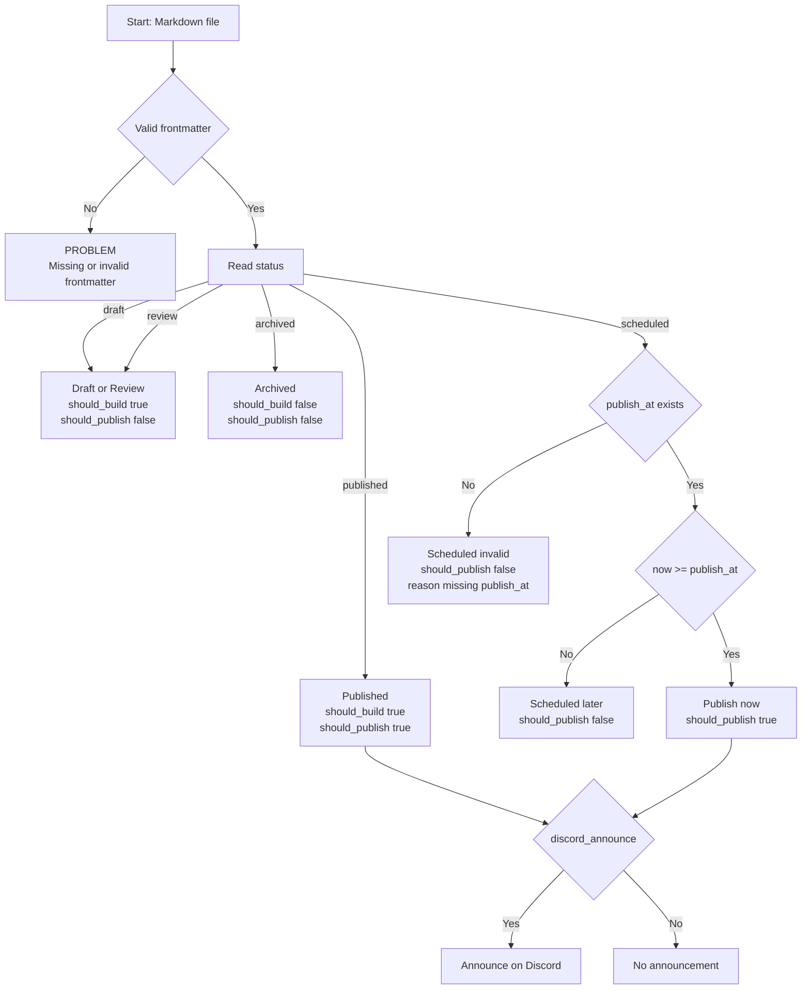

> This diagram documents the decision logic in `scripts/publish.py`.
> Update this when the decision rules change.

```mermaid
flowchart TD
    A[Start: Markdown file] --> B{Valid frontmatter}

    B -- No --> Z[PROBLEM<br>Missing or invalid frontmatter]
    B -- Yes --> C[Read status]

    C -->|draft| D[Draft or Review<br>should_build true<br>should_publish false]
    C -->|review| D
    C -->|archived| E[Archived<br>should_build false<br>should_publish false]

    C -->|published| F[Published<br>should_build true<br>should_publish true]

    C -->|scheduled| G{publish_at exists}

    G -- No --> H[Scheduled invalid<br>should_publish false<br>reason missing publish_at]

    G -- Yes --> I{now >= publish_at}

    I -- No --> J[Scheduled later<br>should_publish false]
    I -- Yes --> K[Publish now<br>should_publish true]

    F --> L{discord_announce}
    K --> L

    L -- Yes --> M[Announce on Discord]
    L -- No --> N[No announcement]
```
